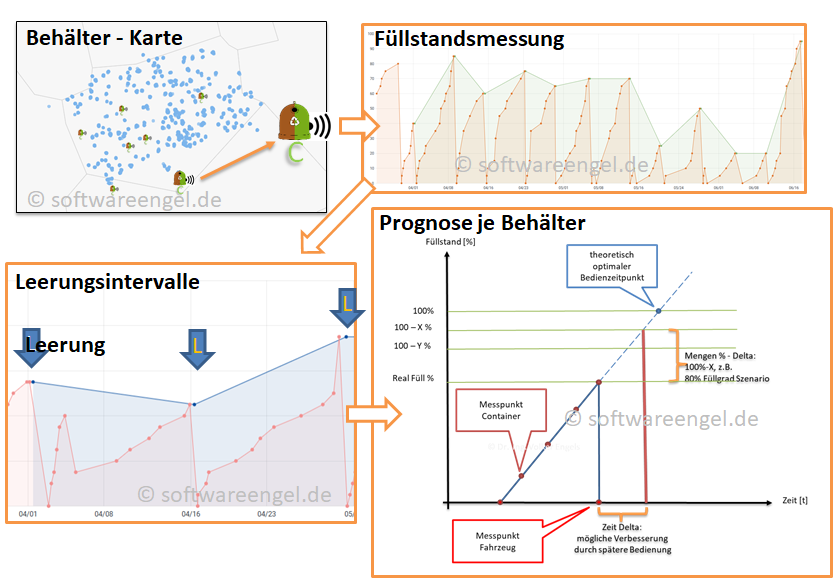

### *Weniger Behälteranfahrten durch automatische Vorhersagen, dynamische und trotzdem resiliente Planung*
{: .text-purple}

# **Modul Revierplanung *Fillingfunction***
{: .text-purple}

Befüllungsfunktion bei Depotcontainern, hier Glassdepot-Container
